---
# try also 'default' to start simple
theme: seriph
# random image from a curated Unsplash collection by Anthony
# like them? see https://unsplash.com/collections/94734566/slidev
background: ./assets/sky.png
# some information about your slides (markdown enabled)
title: AT Protocol 從零開始喵
# info: |
#   ## slidev starter template
#   presentation slides for developers

#   learn more at [sli.dev](https://sli.dev)
# apply UnoCSS classes to the current slide
class: text-center
# https://sli.dev/features/drawing
drawings:
  persist: false
# slide transition: https://sli.dev/guide/animations.html#slide-transitions
transition: fade-out
# enable MDC Syntax: https://sli.dev/features/mdc
mdc: true
fonts:
  sans: 'LINE Seed JP' 
  # sans: 'Source Sans 3'
  # sans: 'Libertinus Serif'

  # sans: 'SFMono-Regular,Menlo,Monaco,Consolas,Liberation Mono,Courier New'
  # local: 'SFMono-Regular,Menlo,Monaco,Consolas,Liberation Mono,Courier New'
themeConfig:
  primary: '#f291a5'
colorSchema: dark
---
# AT Protocol 從零開始喵

 

<NameCard />

<!--
 <carbon:arrow-right />

-->

  <button @click="$slidev.nav.openInEditor()" title="Open in Editor" class="slidev-icon-btn">
    <carbon:edit />
  </button>
  <a href="https://github.com/yuna0x0/NYCU-VTB-ATProtoCourse" target="_blank" class="slidev-icon-btn">
    <carbon:logo-github />
  </a>

---
dragPos:
  at-icon: 504,21,87,91,-5
  bsky-icon: 852,422,102,91,5
  ema: 477,35,320,745,-5
  vtb-logo: 298,26,66,66,6
  hiro: 648,20,297,713,5
---

交大 VTuber 社 - 114-2 社課

<h1 class="!mt-2 !mb-4">AT Protocol 從零開始喵</h1>

<NameCard size="sm" class="mb-6 self-start" />

  

    03/13
    AT Protocol 是什麼？ 實作自己的機器人和演算法！
  

  

    03/20
    OAuth 驗證和你的第一個社交應用程式
  

  

    03/27
    Link in Bio on AT Protocol
  

  
<lucide:clock class="inline-block mr-1" />星期五 19:00 ~ 21:00 | 第 3 - 5 週

  
<lucide:map-pin class="inline-block mr-1" />交大活動中心 537 & Discord 線上

<!--

<lucide:at-sign class="w-full h-full" style="color: #0085ff" />

-->

---
dragPos:
  sherry: 43,181,331,327,-5
  discord-help: 365,292,593,68
---

# 有問題想問！？

### 可以在 **<a href="https://discord.gg/GPBJPshrBU">交大 VTuber 社</a>** Discord 伺服器的 <a href="https://discord.com/channels/806901909356412949/1478581760270008474">`#at-protocal-by-yuna`</a> 頻道 發問！

---
---

    <video autoplay loop muted playsinline class="absolute inset-0 w-full h-full object-cover hue-rotate-130">
        <source src="./assets/sakana.mp4" type="video/mp4" />
    </video>
    

        

            <SakanaWidget />
        

    

# **悠奈喵 (yuna0x0)**

<h2 v-click="[1, 2]">熱愛研究各種東西 和開發遊戲的貓娘 :3</h2>

 

<li v-click="[2, 3]">交大 VTuber 社 - 創社社長</li>

<li v-click="[3, 4]">2023 年受邀加入 Bluesky 封閉測試</li>

<li v-click="[4, 5]">
    致力於推廣去中心化相關技術 
</li>

<li v-click="[5, 6]">
    興趣太多，族繁不及備載 詳細可以去 <a href="https://yuna0x0.com">yuna0x0.com</a> 看喵~
</li>

    <h3>🥺 餵食 Yuna →</h3>
    

---
class: text-center
---

# 我為什麼要教這門課？

  
網路平台改變了我們的社交方式 你透過網路建立情感的時間，可能甚至比現實生活還長

  
但在中心化平台上 你的身分和資料，始終不是你的

  

    
中心化平台能在一朝一夕之間：

    
你長久建立的<b class="color-purple">朋友圈</b>

    
你耗費心力經營的<b class="color-purple">帳號</b>

    
你對於生活的種種<b class="color-purple">足跡與紀錄</b>

  

  
我們難道只能坐以待斃嗎？

  
Mastodon、Misskey 等建構於 ActivityPub 上的平台 讓身分和資料得以分散於獨立伺服器當中

  
但身分是相異的，資料難以遷移和整合

  
且伺服器時常面臨穩定性和倒閉的考驗

  
最後你又再次失去了你的身分和資料...

  
但 AT Protocol 的出現，帶來了新的可能性

  
藉其精妙的設計，在保持系統高效率的同時 讓身分和資料得以遷移

  
不僅如此，因為 AT Protocol 的結構定義語言設計，它不單單能作為微部落格平台

  

    
還能搭建：

    
代碼存儲平台 (eg, <a href="https://tangled.org">Tangled</a>)

    
繪圖/茶繪平台 (eg, <a href="https://pinksea.art">PinkSea</a>)

    
部落格 (eg, <a href="https://about.leaflet.pub">Leaflet</a>)

    
...

  

  
因此希望藉此機會，讓大家了解這樣最新的技術

  
說不定下一個創造人人都在用的平台 就是你 :3

---
class: text-center
---

# 第一堂課程規劃

  

    <lucide:at-sign class="text-5xl mb-4" />
    
AT Protocol 是什麼？

  

  

    <lucide:bot class="text-5xl mb-4" />
    
實作一個機器人 在 Bluesky 上互動

  

  

    <lucide:newspaper class="text-5xl mb-4" />
    
實作自己的演算法 讓河道顯示想看的內容！

  

  

    協定架構
    身份系統 (DID)
    資料儲存 (PDS)
    資料結構 (Lexicon)
    中繼 (Firehose / Jetstream)
    App View
    與&nbsp;Bluesky&nbsp;的關係
  

  

    透過&nbsp;HTTP API (XRPC)&nbsp;實作一個能自動發文、回覆、按讚的機器人
  

  

    建立&nbsp;Feed Generator，根據自訂規則篩選貼文，打造專屬的個人化動態牆
  

---
---

# 中心化 / Fediverse / AT Protocol 的比較

  <CompareCard v-click="[1, 2]" title="中心化平台" desc="Twitter、Facebook、Threads (專有軟體， 半殘 ActivityPub 實作)">
    <template #icon><lucide:building-2 class="text-6xl" /></template>
  </CompareCard>
  <CompareCard v-click="[2, 3]" title="Fediverse (ActivityPub)" desc="Mastodon、Misskey">
    <template #icon><lucide:square-asterisk class="text-6xl" /></template>
  </CompareCard>
  <CompareCard v-click="3" title="AT Protocol" desc="Bluesky、Tangled">
    <template #icon><lucide:at-sign class="text-6xl" /></template>
  </CompareCard>

---
---

# 中心化 / Fediverse / AT Protocol 的比較

  <CompareCard class="shrink-0 w-64" title="中心化平台" desc="Twitter、Facebook、Threads (專有軟體， 半殘 ActivityPub 實作)">
    <template #icon><lucide:building-2 class="text-6xl" /></template>
  </CompareCard>
  

    <li v-click="[1, 2]">單一公司營運並控制所有資料</li>
    <li v-click="[2, 3]">使用者無法選擇演算法或遷移帳號</li>
    <li v-click="3">平台可任意更改規則、封鎖帳號</li>
  

---
---

# 中心化 / Fediverse / AT Protocol 的比較

  <CompareCard class="shrink-0 w-64" title="Fediverse (ActivityPub)" desc="Mastodon、Misskey">
    <template #icon><lucide:square-asterisk class="text-6xl" /></template>
  </CompareCard>
  

      <li v-click="[1, 3]" class="!leading-[2]">伺服器之間透過 ActivityPub 協定互聯 雖一定程度達成去中心化，但隨著節點增多，透過此協定互聯的伺服器頻寬和儲存負擔也將更大</li>
    <li v-click="[3, 4]">帳號綁定在特定伺服器上，不易遷移</li>
    <li v-click="4">伺服器無預警關閉時，資料將會遺失</li>
  

---
---

# 中心化 / Fediverse / AT Protocol 的比較

  <CompareCard class="shrink-0 w-64" title="AT Protocol" desc="Bluesky、Tangled">
    <template #icon><lucide:at-sign class="text-6xl" /></template>
  </CompareCard>
  

    <li v-click="[1, 2]">嘗試解決前面架構的相關問題</li>
    <li v-click="[2, 4]" class="color-purple">去中心化身份架構 (DID) 達成在不同資料伺服器 (PDS) 間遷移帳號</li>
    <li v-click="4" class="color-purple">Lexicon 結構定義語言 允許不同類型的應用程式 (App View) 運行在同一個協定上</li>
  

---
---

# 中心化 / Fediverse / AT Protocol 的比較

  <CompareCard class="shrink-0 w-64" title="AT Protocol" desc="Bluesky、Tangled">
    <template #icon><lucide:at-sign class="text-6xl" /></template>
  </CompareCard>
  

    <li v-click="1" class="color-purple">中繼 (Firehose / Jetstream) 負責串流即時網路活動，並解決 ActivityPub 等協定中，節點增多， 資源負擔更大的問題。</li>
  

---
---

# 從傳統網路應用程式到大規模分散式應用

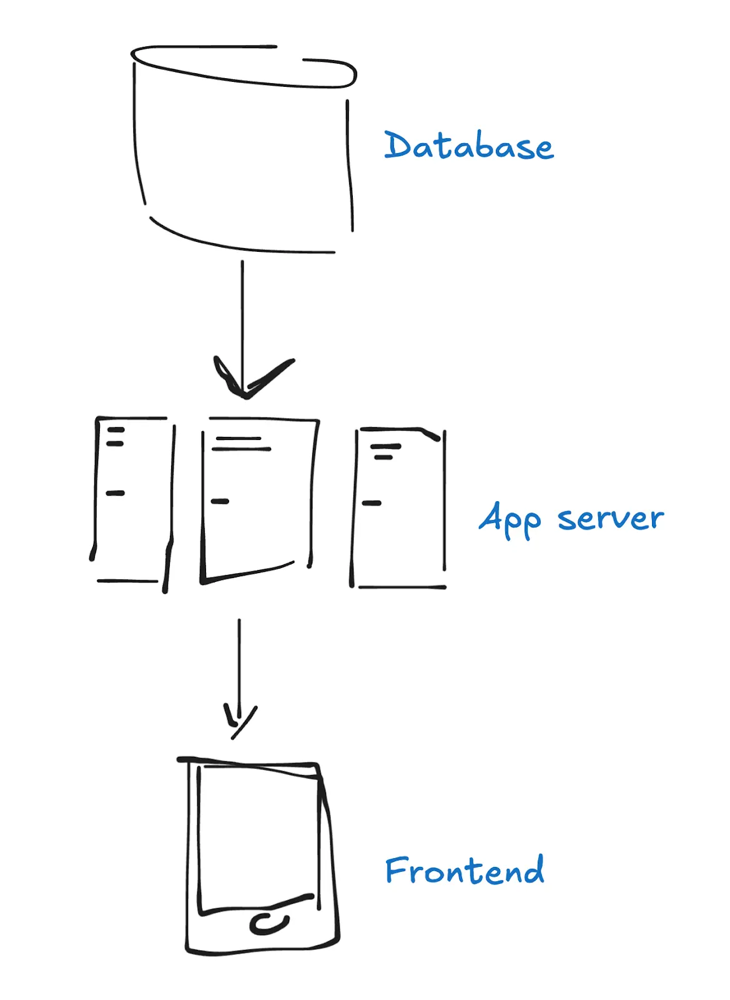

傳統網頁應用：前端 + 後端 + 資料庫

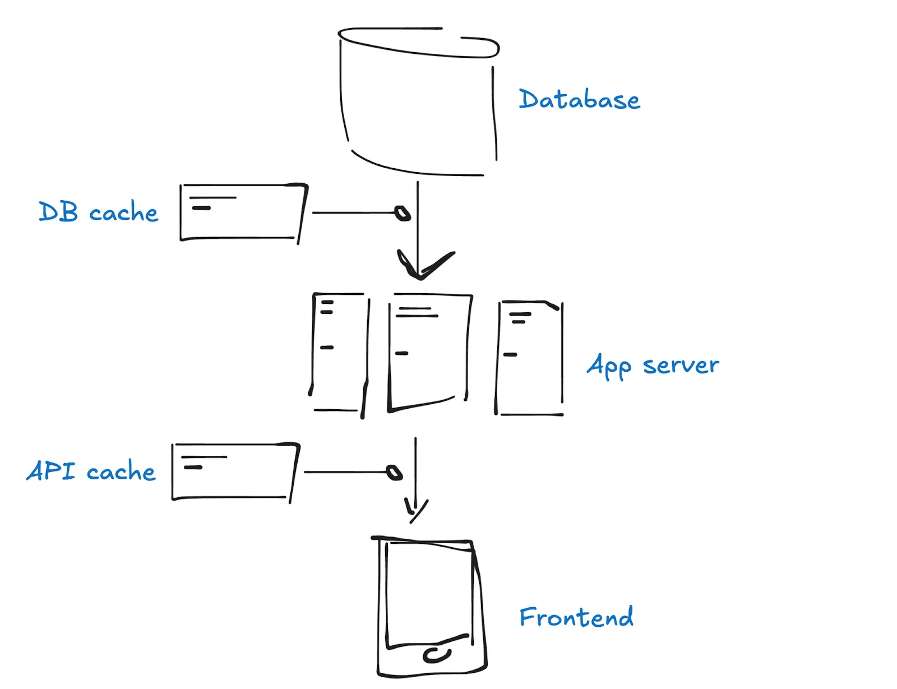

加入快取層應對效能瓶頸

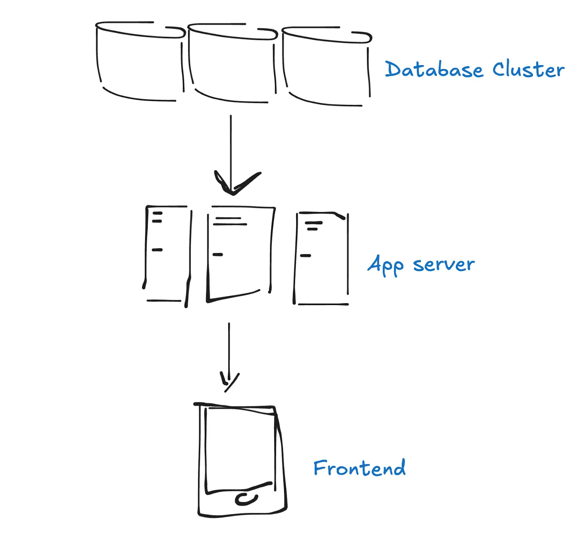

進一步將資料庫分片

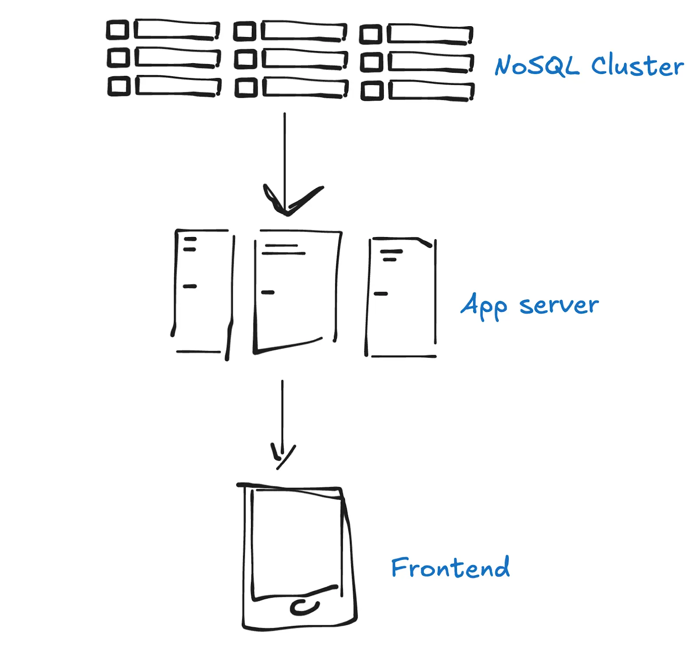

改用 NoSQL 實現最終一致性，提升擴展性

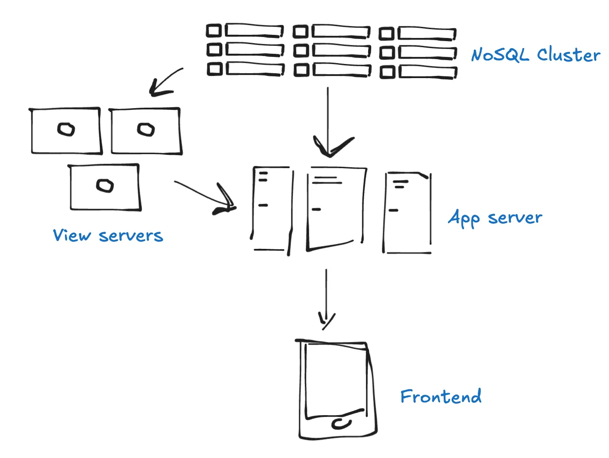

加入 View Server 預先計算查詢，彌補 NoSQL 不足

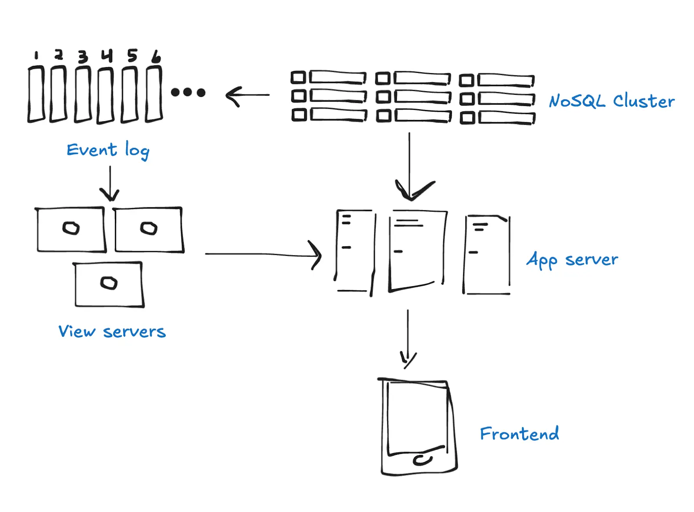

引入事件日誌（如 Kafka）確保 View Server 同步

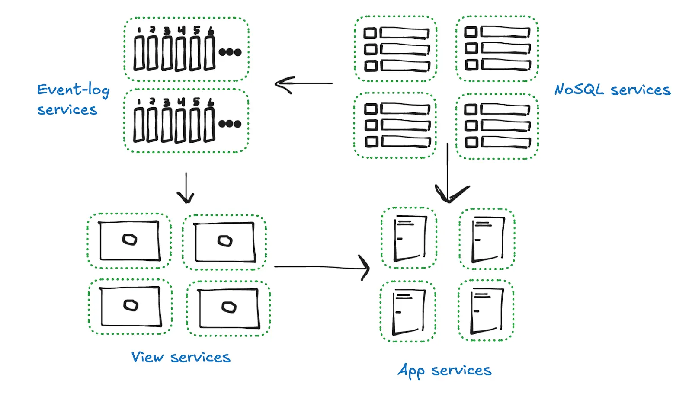

從傳統到分散式應用：將內部服務公開，讓外部節點參與

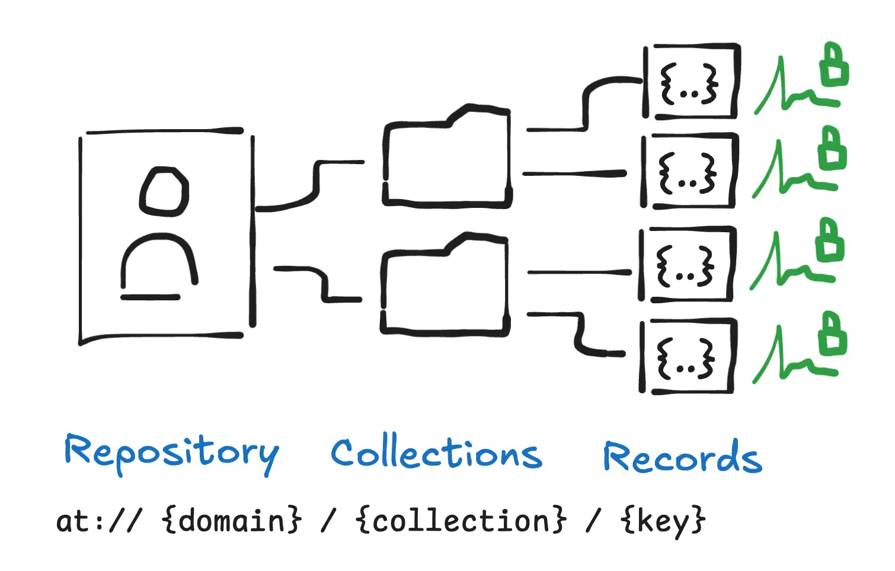

引入個人資料伺服器 (PDS)，藉加密簽章確保資料真實性

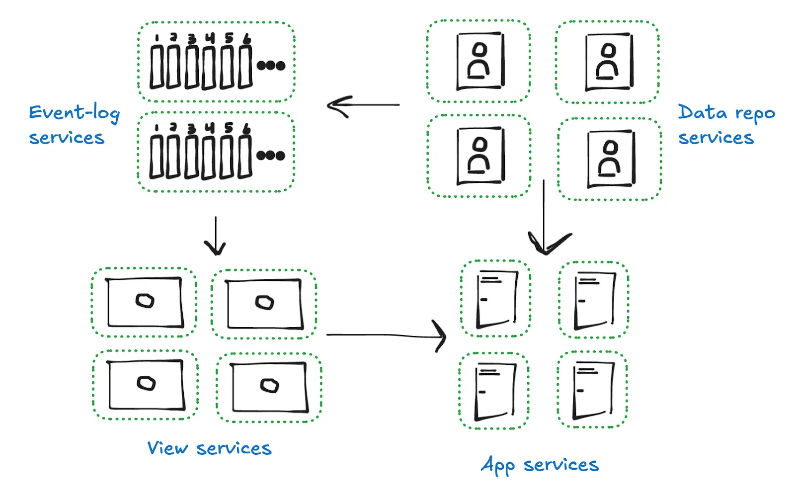

多個 PDS 節點分散託管使用者資料

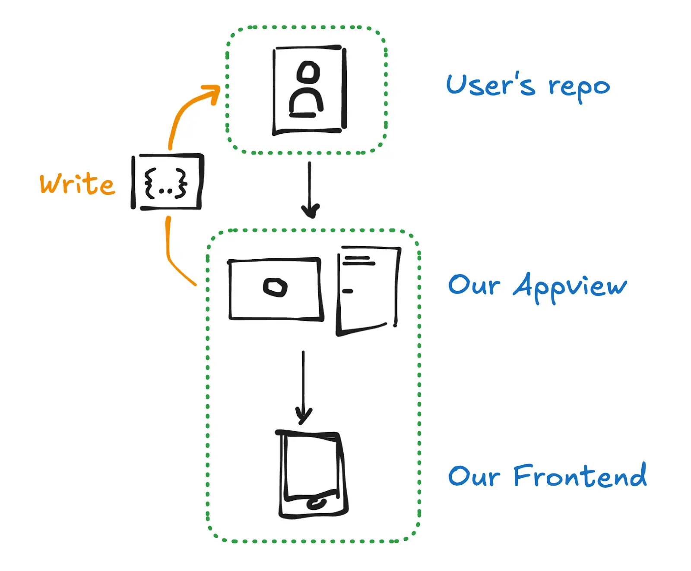

Appview 透過 OAuth 讀寫使用者 PDS

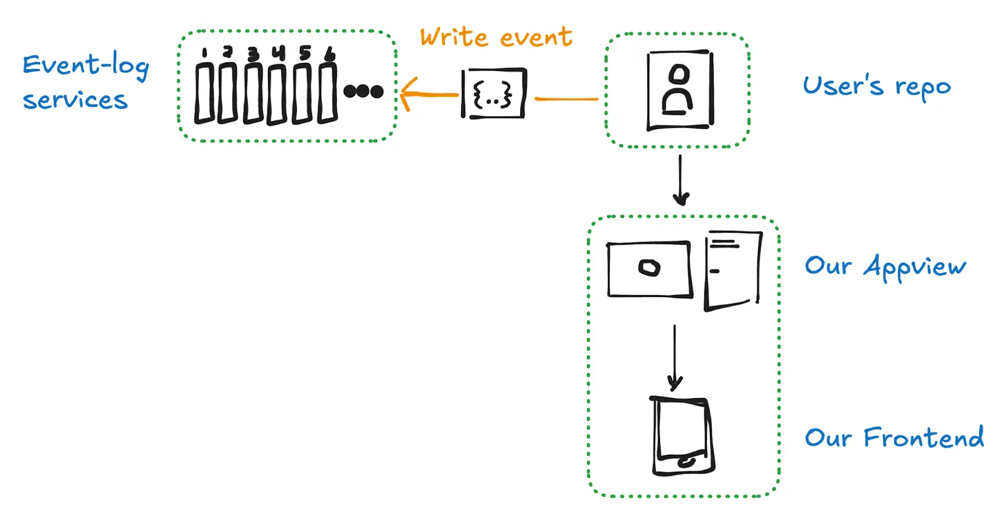

寫入 PDS 後觸發事件日誌到 Relay

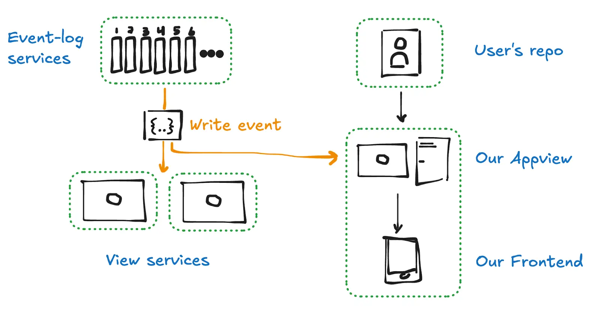

Relay 將事件推送至各 View Server

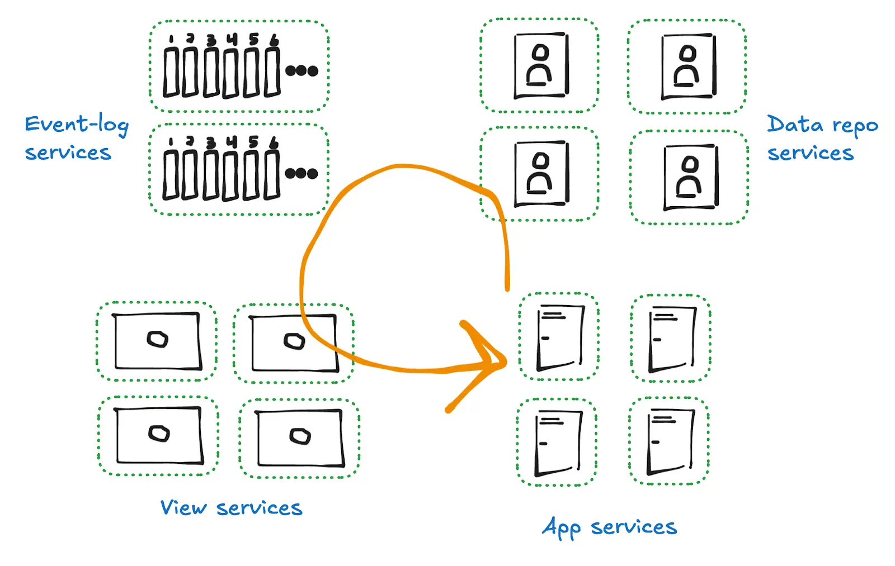

最終達成完整的去中心化資料流循環

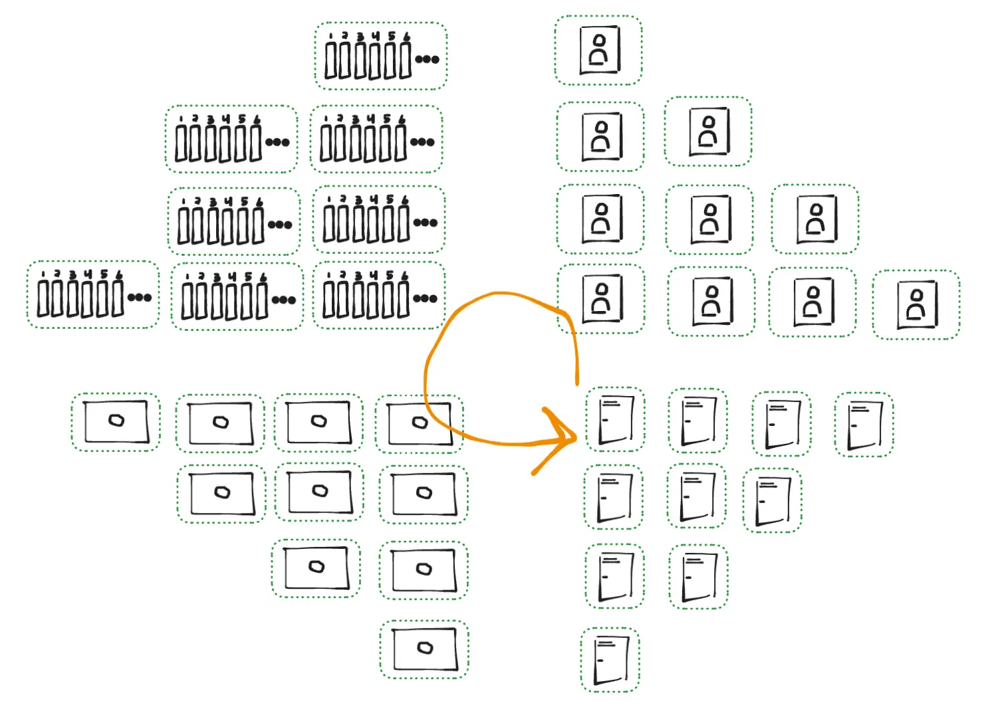

大規模分散式：更多節點、更多應用加入網路

---
dragPos:
  spot-1: 51,119,229,409
  spot-2: 159,120,256,408
  spot-3: 280,120,383,415
  spot-4: 415,119,494,415
---

# AT Protocol 架構圖

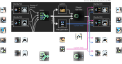

---
dragPos:
  spot-1: 531,258,400,151
  spot-2: 40,331,410,40
  spot-3: 45,254,401,115
  spot-4: 272,255,658,114
---

# DID 架構圖

---
---

# 自訂 Feed：[For You](https://bsky.app/profile/did:plc:3guzzweuqraryl3rdkimjamk/feed/for-you)

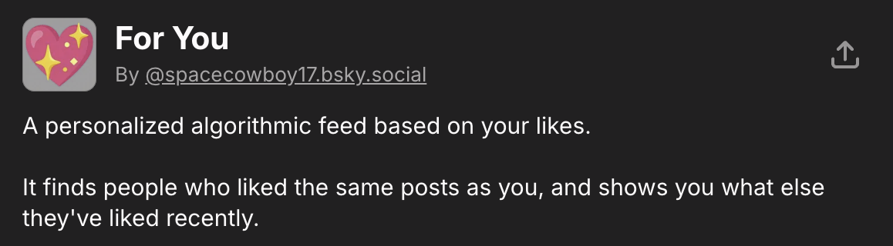

---
---

# 「For You」和 Bluesky 官方「Discover」河道比較

  

    
For You

    <video autoplay loop muted playsinline class="h-full rounded-lg object-contain">
      <source src="./assets/for-you-timeline-demo.mp4" type="video/mp4" />
    </video>
  

  

    
Discover

    <video autoplay loop muted playsinline class="h-full rounded-lg object-contain">
      <source src="./assets/discover-timeline-demo.mp4" type="video/mp4" />
    </video>
  

