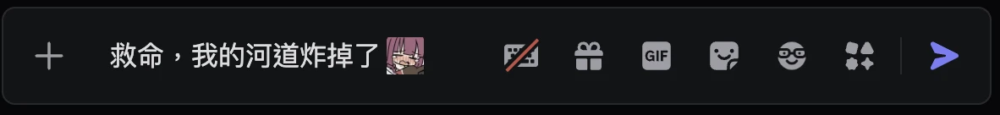
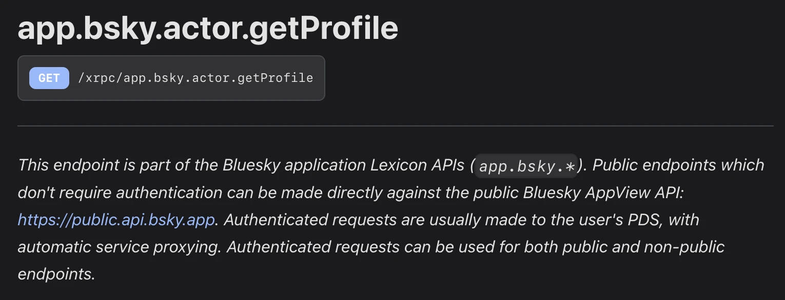
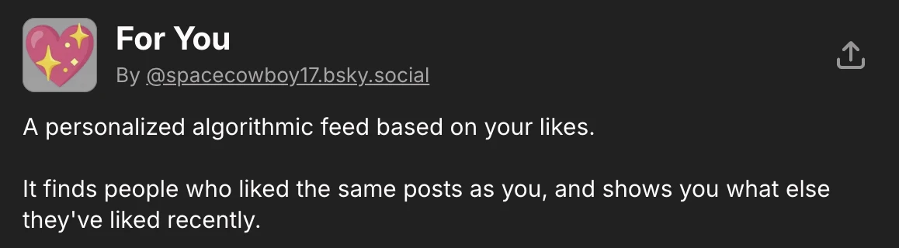
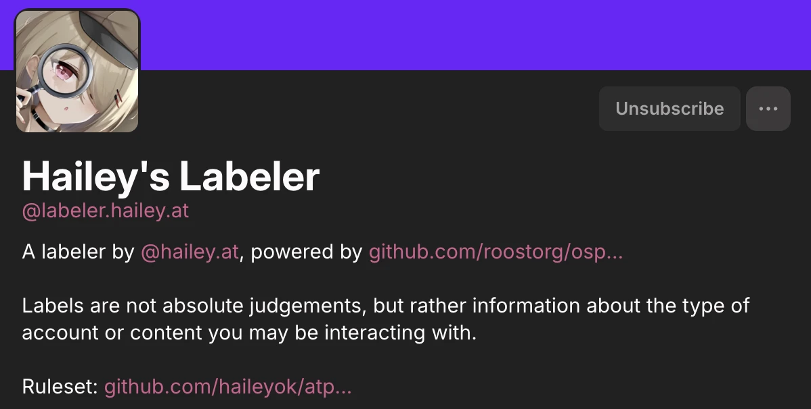
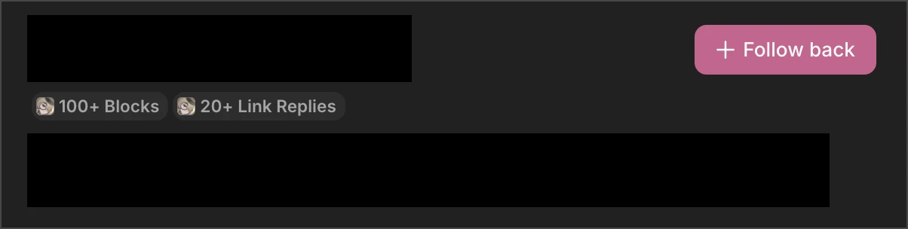
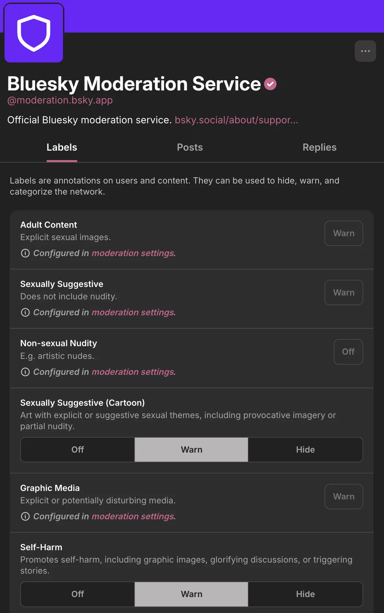
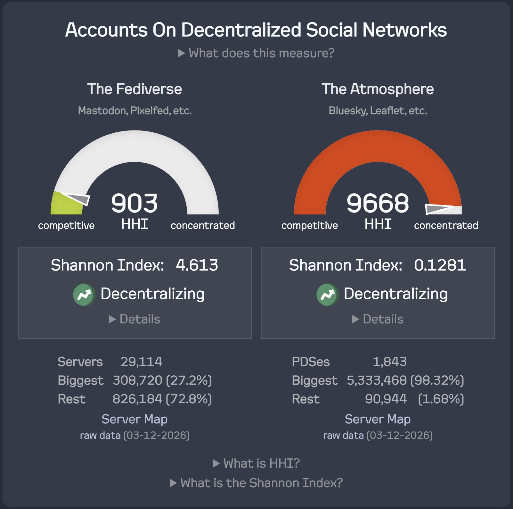
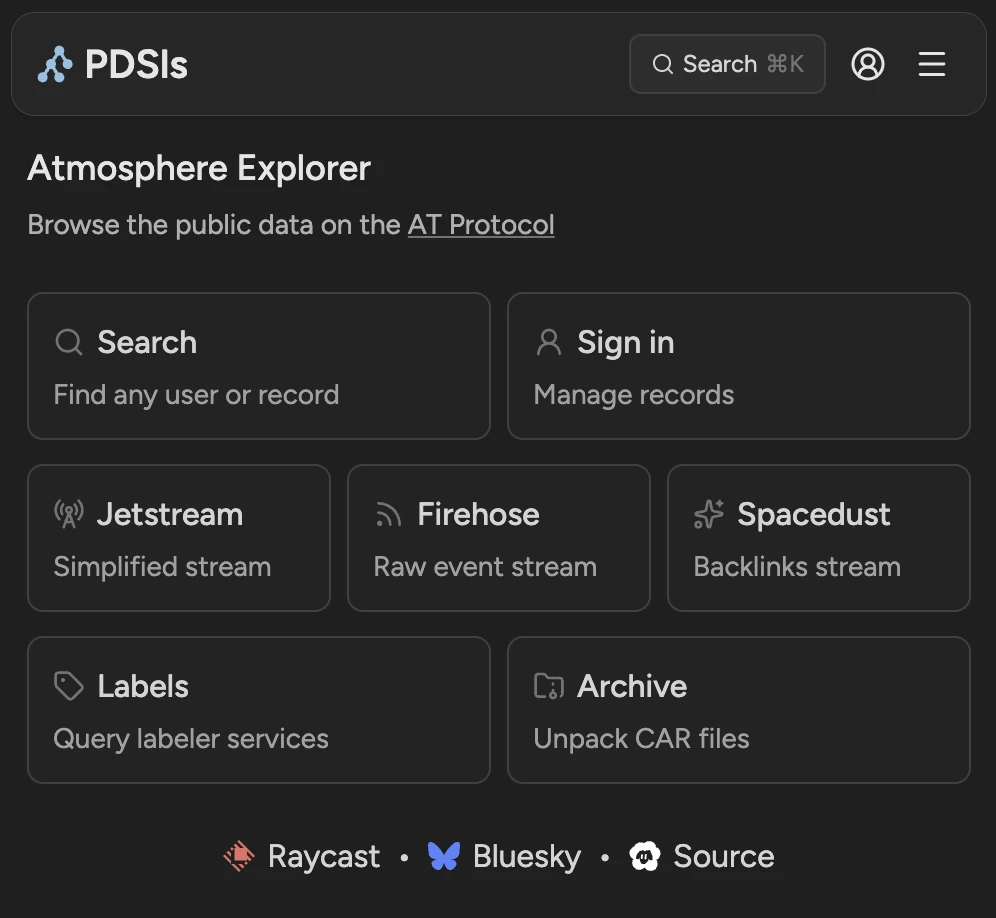
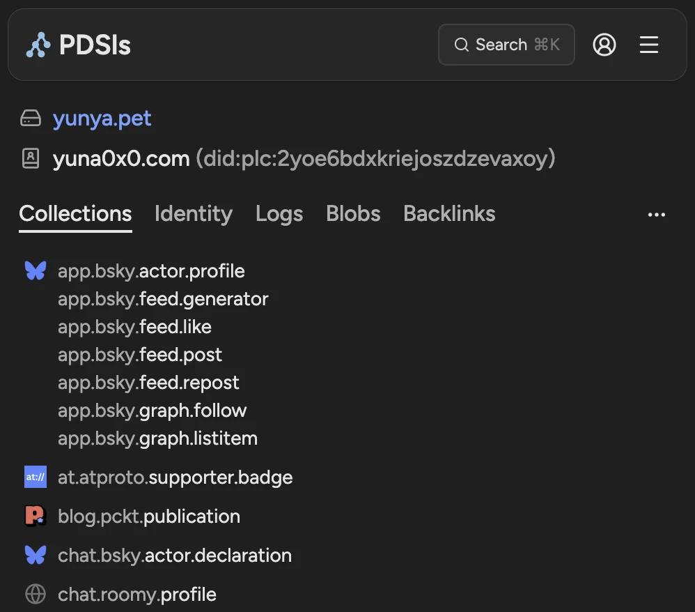
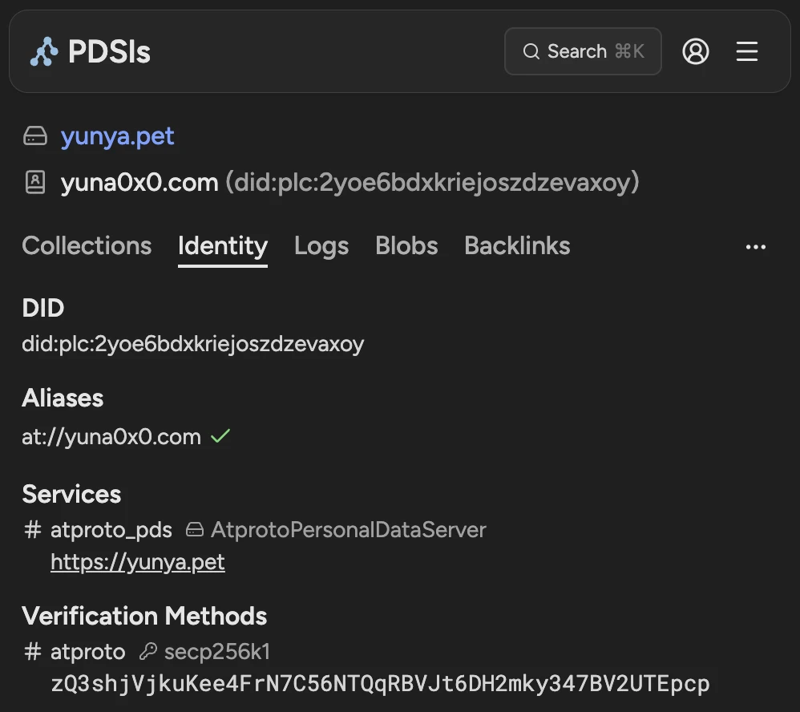

# AT Protocol 從零開始喵

<br>

<NameCard />

<div class="abs-br m-6 text-xl">
  <button v-if="__DEV__" @click="$slidev.nav.openInEditor()" title="Open in Editor" class="slidev-icon-btn">
    <carbon:edit />
  </button>
  <a href="https://github.com/yuna0x0/NYCU-VTB-ATProto-Course" target="_blank" class="slidev-icon-btn">
    <carbon:logo-github />
  </a>
</div>

---
dragPos:
  at-icon: 504,21,87,91,-5
  bsky-icon: 852,422,102,91,5
  ema: 477,35,320,745,-5
  vtb-logo: 298,26,66,66,6
  hiro: 648,20,297,713,5
---


<div class="absolute inset-0 bg-black/50 -z-1" />

<div class="flex h-full">
<div class="w-1/2 flex flex-col justify-center text-left">

<p class="text-white/60 !mb-0">交大 VTuber 社 - 114-2 社課</p>
<h1 class="!mt-2 !mb-4">AT Protocol 從零開始喵</h1>

<NameCard size="sm" class="mb-6 self-start" />

<div class="flex flex-col text-lg">
  <div class="flex gap-6 py-3 border-b border-white/20">
    <span class="font-bold color-#f291a5">03/13</span>
    <span>AT Protocol 是什麼？</span>
  </div>
  <div class="flex gap-6 py-3 border-b border-white/20">
    <span class="font-bold color-#f291a5">03/20</span>
    <span>實作自己的機器人和演算法！<br>OAuth 驗證和你的第一個社交應用程式</span>
  </div>
  <div class="flex gap-6 py-3">
    <span class="font-bold color-#f291a5">03/27</span>
    <span>Link in Bio on AT Protocol</span>
  </div>
</div>

<div class="mt-8 text-white/60 text-base space-y-2">
  <div><lucide:clock class="inline-block mr-1" />星期五 19:00 ~ 21:00 | 第 3 - 5 週</div>
  <div><lucide:map-pin class="inline-block mr-1" />交大活動中心 537 & Discord 線上</div>
</div>

</div>
<div class="w-1/2">
</div>
</div>


---
dragPos:
  sherry: 43,181,331,327,-5
  discord-help: 365,292,593,68
---

# 有問題想問！？

### 可以在 **<a href="https://discord.gg/GPBJPshrBU">交大 VTuber 社</a>** Discord 伺服器的 <a href="https://discord.com/channels/806901909356412949/1478581760270008474">`#at-protocol-by-yuna`</a> 頻道<br>發問！




---
---

<div class="absolute top-0 left-0 bottom-0 w-1/2 overflow-hidden">
    <video autoplay loop muted playsinline class="absolute inset-0 w-full h-full object-cover hue-rotate-130">
        <source src="./assets/sakana.mp4" type="video/mp4" />
    </video>
    <div class="absolute inset-0 bg-black/30">
        <div class="absolute bottom-0 left-0 right-0 flex justify-center z-10">
            <SakanaWidget />
        </div>
    </div>
</div>

<div class="ml-[50%] pl-8">

# **悠奈喵 (yuna0x0)**

<h2 v-click="[1, 2]">熱愛研究各種東西<br>和開發遊戲的貓娘 :3</h2>

<br>

<div class="space-y-1">
<li v-click="[2, 3]">交大 VTuber 社 - <span v-mark.box.purple="[2, 3]">創社社長</span></li>

<li v-click="[3, 4]">2023 年受邀加入 <span class="color-blue">Bluesky</span> 封閉測試</li>

<li v-click="[4, 5]">
    致力於推廣<span v-mark.underline.orange="[4, 5]" class="text-orange-400">去中心化</span>相關技術 
</li>

<li v-click="[5, 6]">
    興趣太多，族繁不及備載<br>詳細可以去 <a href="https://yuna0x0.com">yuna0x0.com</a> 看喵~
</li>
</div>

<div v-click="6" class="flex items-center justify-center gap-4 mt-8">
    <h3>🥺 餵食 Yuna →</h3>
    
</div>

</div>

---
class: text-center
---

# 我為什麼要教這門課？

<div class="relative flex items-center justify-center h-4/5">
  <p v-click="[1, 2]" class="absolute text-3xl !leading-[2]">網路平台改變了我們的社交方式<br>你透過網路建立情感的時間，<b class="color-orange">可能甚至比現實生活還長</b></p>
  <p v-click="[2, 3]" class="absolute text-4xl font-bold !leading-[1.8]">但在中心化平台上<br>你的身分和資料，<span class="color-red">始終不是你的</span></p>
  <div v-click="[3, 10]" class="absolute text-4xl space-y-14">
    <p class="text-white/60 mb-4">中心化平台能在一朝一夕之間：</p>
    <p v-click="4"><span v-mark.cross.red="5">你長久建立的<b class="color-purple">朋友圈</b></span></p>
    <p v-click="6"><span v-mark.cross.red="7">你耗費心力經營的<b class="color-purple">帳號</b></span></p>
    <p v-click="8"><span v-mark.cross.red="9">你對於生活的種種<b class="color-purple">足跡與紀錄</b></span></p>
  </div>
  <p v-click="[10, 11]" class="absolute text-4xl font-bold">我們難道只能坐以待斃嗎？</p>
  <p v-click="[11, 12]" class="absolute text-3xl !leading-[2]">Mastodon、Misskey 等建構於 ActivityPub 上的平台<br>讓身分和資料得以分散於獨立伺服器當中</p>
  <p v-click="[12, 13]" class="absolute text-4xl"><span v-mark.underline.red="12">但身分是相異的，資料難以遷移和整合</span></p>
  <p v-click="[13, 14]" class="absolute text-4xl"><span v-mark.underline.red="13">且伺服器時常面臨穩定性和倒閉的考驗</span></p>
  <p v-click="[14, 15]" class="absolute text-4xl font-bold color-red">最後你又再次失去了你的身分和資料...</p>
  <p v-click="[15, 16]" class="absolute text-4xl">但 <span class="color-blue font-bold">AT Protocol</span> 的出現，帶來了新的可能性</p>
  <p v-click="[16, 17]" class="absolute text-4xl !leading-[2]">藉其精妙的設計，在<b class="color-lime">保持系統高效率</b>的同時<br>讓身分和資料得以遷移</p>
  <p v-click="[17, 18]" class="absolute text-4xl !leading-[2]">不僅如此，因為 AT Protocol 的<b class="color-purple">結構定義語言</b>設計，它不單單能作為微部落格平台</p>
  <div v-click="[18, 23]" class="absolute text-4xl space-y-12 fade-list">
    <p class="text-white/60 mb-4">還能搭建：</p>
    <p v-click="[19, 20]">程式碼託管平台 (eg, <a href="https://tangled.org">Tangled</a>)</p>
    <p v-click="[20, 21]">繪圖/茶繪平台 (eg, <a href="https://pinksea.art">PinkSea</a>)</p>
    <p v-click="[21, 22]">部落格 (eg, <a href="https://about.leaflet.pub">Leaflet</a>)</p>
    <p v-click="[22, 23]">...</p>
  </div>
  <p v-click="[23, 24]" class="absolute text-4xl">因此希望藉此機會，讓大家了解這樣最新的技術</p>
  <p v-click="24" class="absolute text-4xl !leading-[2]">說不定下一個創造人人都在用的平台<br>就是<span v-mark.circle.pink="24">你</span> :3</p>
</div>

<style>
.slidev-vclick-hidden {
  opacity: 0 !important;
}
.fade-list .slidev-vclick-hidden {
  opacity: 0.2 !important;
}
</style>

---
class: text-center
---

# 第一、二堂課程規劃

<div class="grid grid-cols-3 gap-6 mt-8">
  <div v-click="[1, 9]" class="flex flex-col items-center justify-center border border-white/20 rounded-xl p-6 h-full">
    <lucide:at-sign class="text-5xl mb-4" />
    <p class="text-center text-lg font-bold !leading-[2]"><span class="color-orange">AT Protocol</span> 是什麼？</p>
  </div>
  <div v-click="[9, 10]" class="flex flex-col items-center justify-center border border-white/20 rounded-xl p-6 h-full">
    <lucide:bot class="text-5xl mb-4" />
    <p class="text-center text-lg font-bold !leading-[2]">實作一個<span class="color-rose">機器人</span><br>在 Bluesky 上互動</p>
  </div>
  <div v-click="10" class="flex flex-col items-center justify-center border border-white/20 rounded-xl p-6 h-full">
    <lucide:newspaper class="text-5xl mb-4" />
    <p class="text-center text-lg font-bold !leading-[2]">實作<span v-mark.underline.lime="10" class="color-lime">自己的演算法</span><br>讓河道顯示想看的內容！</p>
  </div>
</div>

<div class="details-area relative text-white/80 text-xl h-12">
  <div v-click="[1, 9]" class="absolute inset-x-0 flex justify-center mt-14 gap-6 flex-wrap">
    <span v-mark.box.pink="[2, 3]" class="inline-flex border border-white/40 rounded-xl px-5 py-2">協定架構</span>
    <span v-mark.box.pink="[3, 4]" class="inline-flex border border-white/40 rounded-xl px-5 py-2">身份系統 (DID)</span>
    <span v-mark.box.pink="[4, 5]" class="inline-flex border border-white/40 rounded-xl px-5 py-2">資料儲存 (PDS)</span>
    <span v-mark.box.pink="[5, 6]" class="inline-flex border border-white/40 rounded-xl px-5 py-2">資料結構 (Lexicon)</span>
    <span v-mark.box.pink="[6, 7]" class="inline-flex border border-white/40 rounded-xl px-5 py-2">中繼 (Firehose / Jetstream)</span>
    <span v-mark.box.pink="[7, 8]" class="inline-flex border border-white/40 rounded-xl px-5 py-2">App View</span>
    <span v-mark.box.pink="[8, 9]" class="inline-flex border border-white/40 rounded-xl px-5 py-2">與&nbsp;<span class="color-blue">Bluesky</span>&nbsp;的關係</span>
  </div>
  <div v-click="[9, 10]" class="absolute inset-x-0 flex justify-center mt-20 gap-3 flex-wrap">
    <span class="inline-flex border border-white/40 rounded-xl px-5 py-2">透過&nbsp;<span class="color-purple">HTTP API (XRPC)</span>&nbsp;實作一個能自動發文、回覆、按讚的機器人</span>
  </div>
  <div v-click="10" class="absolute inset-x-0 flex justify-center mt-20  gap-3 flex-wrap">
    <span class="inline-flex border border-white/40 rounded-xl px-5 py-2">建立&nbsp;<span class="color-purple">Feed Generator</span>，根據自訂規則篩選貼文，打造專屬的個人化動態牆</span>
  </div>
</div>

<style>
.details-area .slidev-vclick-hidden {
  opacity: 0 !important;
}
</style>

---
---

# 中心化 / Fediverse / AT Protocol 的比較

<div class="grid grid-cols-3 gap-8 mt-12 items-stretch">
  <CompareCard v-click="[1, 2]" title="中心化平台" desc="Twitter、Facebook、Threads (專有軟體，<br>半殘 ActivityPub 實作)">
    <template #icon><lucide:building-2 class="text-6xl" /></template>
  </CompareCard>
  <CompareCard v-click="[2, 3]" title="Fediverse (ActivityPub)" desc="Mastodon、Misskey">
    <template #icon><lucide:square-asterisk class="text-6xl" /></template>
  </CompareCard>
  <CompareCard v-click="3" title="AT Protocol" desc="Bluesky、Tangled">
    <template #icon><lucide:at-sign class="text-6xl" /></template>
  </CompareCard>
</div>

---
---

# 中心化 / Fediverse / AT Protocol 的比較

<div class="flex items-center gap-16 h-9/10 ml-16">
  <CompareCard class="shrink-0 w-64" title="中心化平台" desc="Twitter、Facebook、Threads (專有軟體，<br>半殘 ActivityPub 實作)">
    <template #icon><lucide:building-2 class="text-6xl" /></template>
  </CompareCard>
  <div class="text-left text-2xl space-y-6">
    <li v-click="[1, 2]">單一公司營運並控制所有資料</li>
    <li v-click="[2, 3]">使用者<span class="color-red">無法</span>選擇演算法或遷移帳號</li>
    <li v-click="3">平台可任意<span class="color-red">更改規則、封鎖帳號</span></li>
  </div>
</div>

---
---

# 中心化 / Fediverse / AT Protocol 的比較

<div class="flex items-center gap-16 h-9/10 ml-16">
  <CompareCard class="shrink-0 w-64" title="Fediverse (ActivityPub)" desc="Mastodon、Misskey">
    <template #icon><lucide:square-asterisk class="text-6xl" /></template>
  </CompareCard>
  <div class="text-left text-2xl space-y-6">
      <li v-click="[1, 3]" class="!leading-[2]">伺服器之間透過 ActivityPub 協定互聯<br><span v-click="[2, 3]" class="text-xl color-zinc">雖一定程度達成去中心化，但隨著<span class="text-xl color-red">節點增多</span>，透過此協定互聯的伺服器頻寬和儲存負擔也將更大</span></li>
    <li v-click="[3, 4]">帳號綁定在特定伺服器上，不易遷移</li>
    <li v-click="4">伺服器無預警關閉時，資料將會遺失</li>
  </div>
</div>

---
---

# 中心化 / Fediverse / AT Protocol 的比較

<div class="flex items-center gap-16 h-9/10 ml-16">
  <CompareCard class="shrink-0 w-64" title="AT Protocol" desc="Bluesky、Tangled">
    <template #icon><lucide:at-sign class="text-6xl" /></template>
  </CompareCard>
  <div class="text-left text-2xl space-y-6">
    <li v-click="[1, 2]">嘗試解決前面架構的相關問題</li>
    <li v-click="[2, 4]" class="color-purple">去中心化身份架構 (DID)<br><span v-click="[3, 4]" class="color-zinc">達成在不同<span class="color-lime">資料伺服器 (PDS)</span> 間遷移帳號</span></li>
    <li v-click="4" class="color-purple">Lexicon 結構定義語言<br><span v-click="5" class="color-zinc">允許不同類型的<span class="color-lime">應用程式 (App View)</span> 運行在同一個協定上</span></li>
  </div>
</div>

---
---

# 中心化 / Fediverse / AT Protocol 的比較

<div class="flex items-center gap-16 h-9/10 ml-16">
  <CompareCard class="shrink-0 w-64" title="AT Protocol" desc="Bluesky、Tangled">
    <template #icon><lucide:at-sign class="text-6xl" /></template>
  </CompareCard>
  <div class="text-left text-2xl space-y-6">
    <li v-click="1" class="color-purple">中繼 (Firehose / Jetstream)<br><span v-click="2" class="color-zinc">負責串流即時網路活動，並解決 ActivityPub 等協定中，節點增多，<br>資源負擔更大的問題。</span></li>
  </div>
</div>

---
---

# 從傳統網路應用程式到大規模分散式應用

<div class="relative flex flex-col items-center justify-center h-[90%]">

<div v-click.hide="1" class="absolute flex flex-col items-center gap-2">

<p class="text-2xl text-white/80">傳統網頁應用：前端 + 後端 + 資料庫</p>
</div>

<div v-click="[1, 2]" class="absolute flex flex-col items-center gap-2">

<p class="text-2xl text-white/80">加入快取層應對效能瓶頸</p>
</div>

<div v-click="[2, 3]" class="absolute flex flex-col items-center gap-2">

<p class="text-2xl text-white/80">進一步將資料庫分片</p>
</div>

<div v-click="[3, 4]" class="absolute flex flex-col items-center gap-2">

<p class="text-2xl text-white/80">改用 NoSQL 實現<a href="https://en.wikipedia.org/wiki/Eventual_consistency">最終一致性</a>，提升擴展性</p>
</div>

<div v-click="[4, 5]" class="absolute flex flex-col items-center gap-2">

<p class="text-2xl text-white/80">加入 View Server 預先計算查詢，彌補 NoSQL 不足</p>
</div>

<div v-click="[5, 6]" class="absolute flex flex-col items-center gap-2">

<p class="text-2xl text-white/80">引入事件日誌（如 <a href="https://kafka.apache.org">Kafka</a>）確保 View Server 同步</p>
</div>

<div v-click="[6, 7]" class="absolute flex flex-col items-center gap-2">

<p class="text-2xl text-white/80">從傳統到分散式應用：將內部服務公開，讓外部節點參與</p>
</div>

<div v-click="[7, 8]" class="absolute flex flex-col items-center gap-2">

<p class="text-2xl text-white/80">引入個人資料伺服器 (PDS)，藉加密簽章確保資料真實性</p>
</div>

<div v-click="[8, 9]" class="absolute flex flex-col items-center gap-2">

<p class="text-2xl text-white/80">多個 PDS 節點分散託管使用者資料</p>
</div>

<div v-click="[9, 10]" class="absolute flex flex-col items-center gap-2">

<p class="text-2xl text-white/80">Appview 透過 OAuth 讀寫使用者 PDS</p>
</div>

<div v-click="[10, 11]" class="absolute flex flex-col items-center gap-2">

<p class="text-2xl text-white/80">寫入 PDS 後觸發事件日誌到 Relay</p>
</div>

<div v-click="[11, 12]" class="absolute flex flex-col items-center gap-2">

<p class="text-2xl text-white/80">Relay 將事件推送至各 View Server</p>
</div>

<div v-click="[12, 13]" class="absolute flex flex-col items-center gap-2">

<p class="text-2xl text-white/80">最終達成完整的去中心化資料流循環</p>
</div>

<div v-click="13" class="absolute flex flex-col items-center gap-2">

<p class="text-2xl text-white/80">大規模分散式：更多節點、更多應用加入網路</p>
</div>

</div>

<style>
.slidev-vclick-hidden { opacity: 0 !important; }
</style>

---
dragPos:
  spot-1: 51,119,229,409
  spot-2: 159,120,256,408
  spot-3: 280,120,383,415
  spot-4: 415,119,494,415
---

# AT Protocol 架構圖

<div class="flex items-center justify-center h-full overflow-hidden -mt-4">

</div>

<div v-click="[1, 2]" v-drag="'spot-1'" class="rounded-md" style="box-shadow: 0 0 0 9999px rgba(0,0,0,0.8)" />
<div v-click="[2, 3]" v-drag="'spot-2'" class="rounded-md" style="box-shadow: 0 0 0 9999px rgba(0,0,0,0.8)" />
<div v-click="[3, 4]" v-drag="'spot-3'" class="rounded-md" style="box-shadow: 0 0 0 9999px rgba(0,0,0,0.8)" />
<div v-click="4" v-drag="'spot-4'" class="rounded-md" style="box-shadow: 0 0 0 9999px rgba(0,0,0,0.8)" />

<style>
.slidev-vclick-hidden {
  opacity: 0 !important;
}
</style>

---
dragPos:
  spot-1: 531,258,400,151
  spot-2: 40,331,410,40
  spot-3: 45,254,401,115
  spot-4: 272,255,658,114
---

# DID 架構圖

<div class="flex items-center justify-center h-full">

</div>

<div v-click="[1, 2]" v-drag="'spot-1'" class="rounded-md" style="box-shadow: 0 0 0 9999px rgba(0,0,0,0.8)" />
<div v-click="[2, 3]" v-drag="'spot-2'" class="rounded-md" style="box-shadow: 0 0 0 9999px rgba(0,0,0,0.8)" />
<div v-click="[3, 4]" v-drag="'spot-3'" class="rounded-md" style="box-shadow: 0 0 0 9999px rgba(0,0,0,0.8)" />
<div v-click="4" v-drag="'spot-4'" class="rounded-md" style="box-shadow: 0 0 0 9999px rgba(0,0,0,0.8)" />

<style>
.slidev-vclick-hidden {
  opacity: 0 !important;
}
</style>

---
---

# 個人資料伺服器 (PDS)

<div class="flex gap-12 h-[80%] mt-4">
<div class="flex-1 flex flex-col justify-center">

<p v-click="[1, 2]" class="text-2xl font-bold color-blue">「你在 AT Protocol 上的家」</p>

<div class="h-8"></div>

<div class="text-xl space-y-4">
<li v-click="[2, 3]">託管你的<span class="color-purple font-bold">資料倉庫 (Data Repository)</span><br>類似 Git 但用於資料庫記錄</li>
<li v-click="[3, 4]">管理你的<span class="color-purple font-bold">身份 (DID)</span>、帳號、簽章金鑰</li>
<li v-click="[4, 5]">處理驗證、授權，並代理請求至其他服務</li>
<li v-click="[5, 6]">資料可透過 CAR 檔匯出，自由<span class="color-lime font-bold">遷移</span>至其他 PDS</li>
</div>

</div>
<div class="flex-1 flex flex-col justify-center">

<div v-click="[6, 7]" class="space-y-3">
<p class="text-white/60 text-lg mb-2">PDS 實作：</p>
<div class="flex flex-col gap-2">
  <span class="border border-white/30 rounded-xl px-4 py-2 text-base"><a href="https://github.com/bluesky-social/pds">官方 PDS</a> — TypeScript，Bluesky 官方參考實作</span>
  <span class="border border-white/30 rounded-xl px-4 py-2 text-base"><a href="https://tangled.org/tranquil.farm/tranquil-pds">Tranquil</a> — Rust，支援 Passkey / 2FA / SSO</span>
  <span class="border border-white/30 rounded-xl px-4 py-2 text-base"><a href="https://tangled.org/hailey.at/cocoon">Cocoon</a> — Go，輕量級實驗性 PDS</span>
</div>
</div>

<div v-click="7" class="space-y-3 mt-4">
<p class="text-white/60 text-lg mb-2">搬家工具：</p>
<div class="flex flex-col gap-2">
  <span class="border border-white/30 rounded-xl px-4 py-2 text-base"><a href="https://pdsmoover.com">PDS MOOver</a> — 遷移、備份、還原帳號</span>
  <span class="border border-white/30 rounded-xl px-4 py-2 text-base"><a href="https://github.com/bluesky-social/goat">goat</a> — AT Protocol CLI 工具</span>
</div>
</div>

</div>
</div>

---
---

# 結構定義語言 (Lexicon)

<div class="flex gap-12 h-[80%] mt-4">
<div class="flex-1 flex flex-col justify-center">

<p v-click="[1, 2]" class="text-2xl font-bold color-blue">「AT Protocol 的共通語言」</p>

<div class="h-8"></div>

<div class="text-xl space-y-4">
<li v-click="[2, 3]">類似 <span class="color-purple font-bold">JSON Schema</span> + AT Protocol<br>專屬功能和語義</li>
<li v-click="[3, 4]">使用 <span class="color-purple font-bold">NSID</span>（反向 DNS）命名<br><code class="text-base">app.bsky.feed.post</code>、<code class="text-base">com.atproto.repo.getRecord</code></li>
<li v-click="[4, 5]">可以發佈新版本，但須維持<span class="color-red font-bold">向前與向後相容</span>，破壞性變更需建立新 Lexicon</li>
</div>

</div>
<div class="flex-1 flex flex-col justify-center">

<div v-click="[5, 6]" class="origin-left scale-90 ml-4">

```json
{
  "text": "喵 (´• ω •`)",
  "$type": "app.bsky.feed.post",
  "createdAt": "2023-05-08T07:30:19.927Z"
}
```

</div>

<div v-click="6" class="origin-left scale-90 ml-4">

```json
{
  "lexicon": 1,
  "id": "app.bsky.feed.post",
  "defs": {
    "main": {
      "type": "record",
      "key": "tid",
      "record": {
        "required": ["text", "createdAt"],
        "properties": {
          "text": {
            "type": "string",
            "maxGraphemes": 300
          },
          "createdAt": {
            "type": "string",
            "format": "datetime"
          }
        }
      }
    }
  }
}
```

</div>

</div>
</div>

---

# 中繼 (Firehose / Jetstream)

<div class="flex gap-12 h-[80%] mt-4">
<div class="flex-1 flex flex-col justify-center">

<p v-click="[1, 2]" class="text-2xl font-bold color-blue">「全網路的即時資料串流」</p>

<div class="h-8"></div>

<div class="text-xl space-y-4">
<li v-click="[2, 3]"><span class="color-purple font-bold">Relay</span> 從各 PDS 蒐集更新，<br>匯聚成一條 <span class="color-purple font-bold">Firehose</span> 串流</li>
<li v-click="[3, 4]"><span class="color-purple font-bold">Jetstream</span> 是輕量替代方案<br>將 CBOR/CAR 二進位格式轉為 <span class="color-lime font-bold">JSON</span>，支援按 Collection（NSID）或 DID 過濾</li>
</div>

</div>
<div class="flex-1 flex flex-col justify-center">

<div v-click="[4, 5]" class="space-y-3">
<p class="text-white/60 text-lg mb-2">Firehose vs Jetstream：</p>
<div class="flex flex-col gap-2 text-base">
  <span class="border border-white/30 rounded-xl px-4 py-2"><lucide-rss class="inline text-orange size-4 mr-1" /> <b>Firehose</b> | 二進位 CBOR/CAR，含密碼學簽章，可驗證</span>
  <span class="border border-white/30 rounded-xl px-4 py-2"><lucide-radio-tower class="inline text-lime size-4 mr-1" /> <b>Jetstream</b> | JSON 格式，低頻寬，簡單易用</span>
</div>
</div>

<div v-click="5" class="space-y-3 mt-4">
<p class="text-white/60 text-lg mb-2">注意事項：</p>
<div class="flex flex-col gap-2 text-base">
  <span class="border border-red/30 rounded-xl px-4 py-2"><lucide-shield-off class="inline text-red size-4 mr-1" /> Jetstream <span class="color-red font-bold">不含密碼學簽章</span>，不適合備份或審查</span>
</div>
</div>

</div>
</div>

---

# 中繼 (Firehose / Jetstream)

<div class="flex gap-8 h-[80%] mt-4">
<div class="flex-[3] flex flex-col justify-start">

```bash {0|all|0}
websocat wss://jetstream1.us-east.bsky.network/subscribe | jq . --unbuffered
```

```json {0|all|2|3|4|5-19|6|7-8|9-17|18|all}
{
  "did": "did:plc:2yoe6bdxkriejoszdzevaxoy",
  "time_us": 1773324027850713,
  "kind": "commit",
  "commit": {
    "rev": "3mgukqf64fs25",
    "operation": "create",
    "collection": "app.bsky.feed.like",
    "rkey": "3mgukqf5xjk25",
    "record": {
      "$type": "app.bsky.feed.like",
      "createdAt": "2026-03-12T14:00:26.645Z",
      "subject": {
        "cid": "bafyreigu6kkqerpwycbndg5oazwb336e4sbepub6b7qpjz5ohjyj4jhpyi",
        "uri": "at://did:plc:3xrfdkmbvsmmhltwyisq5ucp/app.bsky.feed.post/3mguhp5csd22o"
      }
    },
    "cid": "bafyreiglbbgggb6ruuzz24cna4vxv476ggym43eyuuudvt3vev4ivhfrli"
  }
}
```

</div>

<div class="flex-[2] flex flex-col justify-center text-base space-y-2 mt-8">

<p v-click="[1, 2]" class="color-zinc">連線至 Jetstream</p>
<p v-click="[3, 4]" class="color-zinc">收到 JSON 事件</p>
<p v-click="[4, 5]"><span class="color-purple font-bold">did</span> — 使用者身份</p>
<p v-click="[5, 6]"><span class="color-purple font-bold">time_us</span> — 時間戳</p>
<p v-click="[6, 7]"><span class="color-purple font-bold">kind</span> — 事件類型</p>
<p v-click="[7, 8]"><span class="color-purple font-bold">commit</span> — 變更內容</p>
<p v-click="[8, 9]"><span class="color-lime font-bold">rev</span> — repo 修訂版號</p>
<p v-click="[9, 10]"><span class="color-lime font-bold">operation / collection</span> — 操作與集合</p>
<p v-click="[10, 11]"><span class="color-lime font-bold">rkey / record</span> — 鍵值與內容</p>
<p v-click="[11, 12]"><span class="color-lime font-bold">cid</span> — 內容雜湊</p>
<p v-click="12" class="color-zinc">完整事件結構</p>

</div>
</div>

---
---

# App View

<div class="flex gap-12 h-[80%] mt-4">
<div class="flex-1 flex flex-col justify-center">

<p v-click="[1, 2]" class="text-2xl font-bold color-blue">「將原始資料轉化為應用體驗」</p>

<div class="h-8"></div>

<div class="text-xl space-y-4">
<li v-click="[2, 3]">從 Relay 消費 Firehose 串流，<br>建立<span class="color-purple font-bold">索引與聚合指標</span>（按讚數、轉發數）</li>
<li v-click="[3, 4]">提供<span class="color-purple font-bold">內容探索</span>、演算法排序、使用者搜尋</li>
<li v-click="[4, 5]">不同 App View 可實作不同<span class="color-lime font-bold">應用</span><br>（微部落格、長文、茶繪…）</li>
</div>

</div>
<div class="flex-1 flex flex-col justify-center">

<div v-click="[5, 6]">
<p class="text-white/60 text-lg mb-2"><code>app.bsky.*</code> 的公開端點主要由 Bluesky App View 提供：</p>

</div>

<div v-click="6" class="space-y-3 mt-4">
<p class="text-white/60 text-lg mb-2">App View 實作：</p>
<div class="flex flex-col gap-2">
  <span class="border border-white/30 rounded-xl px-4 py-2 text-base"><a href="https://github.com/bluesky-social/atproto/tree/main/packages/bsky">@atproto/bsky</a> — TypeScript，Bluesky 官方實作</span>
  <span class="border border-white/30 rounded-xl px-4 py-2 text-base"><a href="https://tangled.org/tangled.org/core/tree/master/appview">Tangled AppView</a> — Go，Tangled 的程式碼協作平台</span>
</div>
</div>

</div>
</div>

---
---

# 與 Bluesky 的關係

<div class="flex gap-12 h-[80%] mt-4">
<div class="flex-1 flex flex-col justify-center">

<p v-click="[1, 2]" class="text-2xl font-bold color-blue !leading-[2]">「Bluesky 是 AT Protocol 上<br>的一個應用」</p>

<div class="h-8"></div>

<div class="text-xl space-y-4">
<li v-click="[2, 3]">Bluesky 團隊<span class="color-purple font-bold">開發並維護</span> AT Protocol</li>
<li v-click="[3, 4]">Bluesky 實作的是 <code class="text-base">app.bsky.*</code> Lexicon<br>（微部落格），但協定本身<span class="color-lime font-bold">不限於此</span></li>
</div>

</div>
<div class="flex-1 flex flex-col justify-center">

<div v-click="4" class="space-y-3">
<p class="text-white/60 text-lg mb-2">Bluesky 營運的服務：</p>

| 服務 | 位址 |
| --- | --- |
| Relay | `bsky.network` |
| Entryway | `bsky.social` |
| AppView | `api.bsky.app` |
| Chat / DMs | `api.bsky.chat` |
| 審核 (Ozone) | `mod.bsky.app` |

</div>

</div>
</div>

---
---

# 自訂 Feed：[For You](https://bsky.app/profile/did:plc:3guzzweuqraryl3rdkimjamk/feed/for-you)

<h4 class="text-xl"><b class="color-lime">不再被平台演算法綁架：</b>建立自訂演算法，讓使用者訂閱自己想看的 Feed</h4>

<div class="flex items-center justify-center gap-12 h-[70%]">


</div>

---
---

# 「For You」和 Bluesky 官方「Discover」河道比較

<div class="flex gap-4 h-[80%] mt-2">
  <div class="flex-1 flex flex-col items-center">
    <p class="text-lg font-bold mb-2">For You</p>
    <video autoplay loop muted playsinline class="h-full rounded-lg object-contain">
      <source src="./assets/for-you-timeline-demo.mp4" type="video/mp4" />
    </video>
  </div>
  <div class="flex-1 flex flex-col items-center">
    <p class="text-lg font-bold mb-2">Discover</p>
    <video autoplay loop muted playsinline class="h-full rounded-lg object-contain">
      <source src="./assets/discover-timeline-demo.mp4" type="video/mp4" />
    </video>
  </div>
</div>

---
---

# 自訂 Labeler: [Hailey's Labeler](https://bsky.app/profile/did:plc:saslbwamakedc4h6c5bmshvz)

<h4 class="text-xl"><b class="color-lime">決定自己想要的內容審查：</b>建立標籤服務，為內容加上自訂標記</h4>

<div class="flex items-center justify-center gap-8 h-[65%] mt-16">
<div class="flex flex-col items-center gap-2 h-full">
  
  
</div>

</div>

---
---

# 調整 Labeler 的偏好設定

<div class="flex gap-8 h-[90%] mt-4">
<div class="flex-[3] flex flex-col justify-center">

<div class="text-xl space-y-8">
<p v-click="[1, 2]"><span class="color-zinc font-bold">1.</span> 進入 Labeler 的個人頁面，點擊 <span class="color-blue font-bold">訂閱標記服務</span></p>
<p v-click="[2, 3]"><span class="color-zinc font-bold">2.</span> 前往 <span class="color-purple font-bold">設定 → 內容管理</span></p>
<p v-click="[3, 4]"><span class="color-zinc font-bold">3.</span> 找到已訂閱的 Labeler，進入標籤列表</p>
<p v-click="4"><span class="color-zinc font-bold">4.</span> 針對每個標籤選擇<br>&emsp;&emsp;<span class="color-gray font-bold">關閉</span> / <span class="color-lime font-bold">顯示標記</span> / <span class="color-yellow font-bold">警告</span> / <span class="color-red font-bold">隱藏</span></p>
</div>

</div>
<div class="flex-[2] flex items-center justify-center overflow-hidden">



</div>
</div>

---
---

# 講了這麼多，AT Protocol 就沒有不足的地方嗎？

<div class="flex gap-8 h-[80%] mt-4">
<div class="flex-1 flex flex-col justify-center pt-8">

<div class="space-y-10">
<div v-click="[1, 2]">
<p class="text-2xl font-bold">尚未支援<span class="color-red">非公開資料</span></p>
<p class="text-lg text-white/60 mt-1">私人帳號、群組、限定分享等機制仍在規劃中<br>官方建議不要用現有機制硬去加密</p>
</div>
<div v-click="[2, 3]">
<p class="text-2xl font-bold"><span class="color-red">治理與標準化</span>尚未完成</p>
<p class="text-lg text-white/60 mt-1">預計未來提交至 IETF 進行獨立審查</p>
</div>
<div v-click="3">
<p class="text-2xl font-bold">去中心化<span class="color-red">仍需時間</span></p>
<p class="text-lg text-white/60 mt-1">多數帳號仍在 Bluesky 官方 PDS 上</p>
</div>
</div>

</div>
<div class="flex-1 relative">

<div v-click="3" class="absolute -bottom-16 left-0 right-0 flex flex-col items-center scale-125 origin-bottom">

<p class="text-xs text-white/40 mt-1">來源：<a href="https://arewedecentralizedyet.online">arewedecentralizedyet.online</a></p>
</div>

</div>
</div>

---
---

# 本週作業：熟悉 [PDSls](https://pdsls.dev)，未來開發會時常用到它

<p class="text-xl text-white/60">PDSls 是一個 AT Protocol 探索工具，可以瀏覽 AT Protocol 上的公開資料</p>

<div class="flex items-center justify-center gap-6 h-[60%] mt-12">



</div>

---
---


<div class="absolute inset-0 bg-black/50 -z-1" />

<div class="flex flex-col items-center justify-center h-full gap-6">

<h1 class="!text-4xl font-bold">謝謝大家！下週見喵 :3</h1>
</div>

<p class="absolute bottom-4 right-6 text-xs text-white/40">GIF 來源：<a href="https://x.com/hyouenn/status/1990701565305569692" target="_blank">@hyouenn</a></p>
